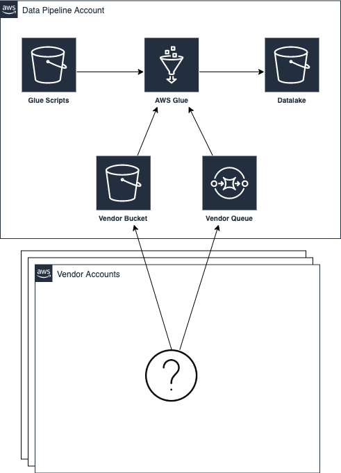

# CDK Quest



## Data Pipeline

Contains the core data pipeline resource setup in AWS which includes Glue, SQS and various S3 Buckets.

### CDK Setup
From the [quest-data-pipeline/](quest-data-pipeline/) directory, run the following commands:
```
npm install -g cdk
npm run cdk deploy -- --parameters bucketNamePrefix=<prefix>
```

If the aws account you're deploy to was never boostrapped before, run the following command before deploying:
```
npm run cdk bootstrap aws://<account-id>/us-east-1
```

## Vendor Bootstrap

Contains resources for bootstrapping a new vendor allowing the aws account to upload files to the data pipeline account.

### CDK Setup
From the [quest-vendor-bootstrap/](quest-vendor-bootstrap/) directory, run the following commands:
```
npm install -g cdk
npm run cdk deploy -- --parameters accountId=<account> --parameters vendorName=<vendor>
```

## Demo Scripts
Examples are located in the [scripts/](scripts/) directory. The following command can be used for uploading a file to the data pipeline (replacing parameters with actual resource names/urls):
```
sh uploadFile.sh test-vendor test-vendor-bucket https://sqs.us-east-1.amazonaws.com/1234567890/test-vendor-queue.fifo
```
To see a very basic example using connectors, execute:
```
sh uploadCSV.sh test-vendor test-vendor-bucket $replace_with_QuestDataPipelineStack.csvqueueUrl
```

The corresponding job will connect and transform the file from .csv to .json
